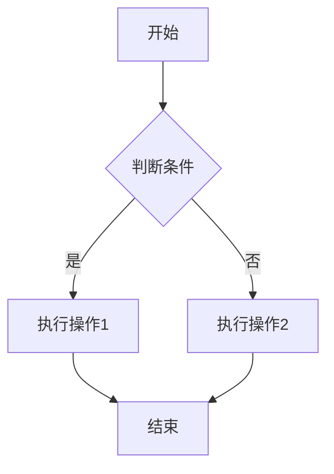
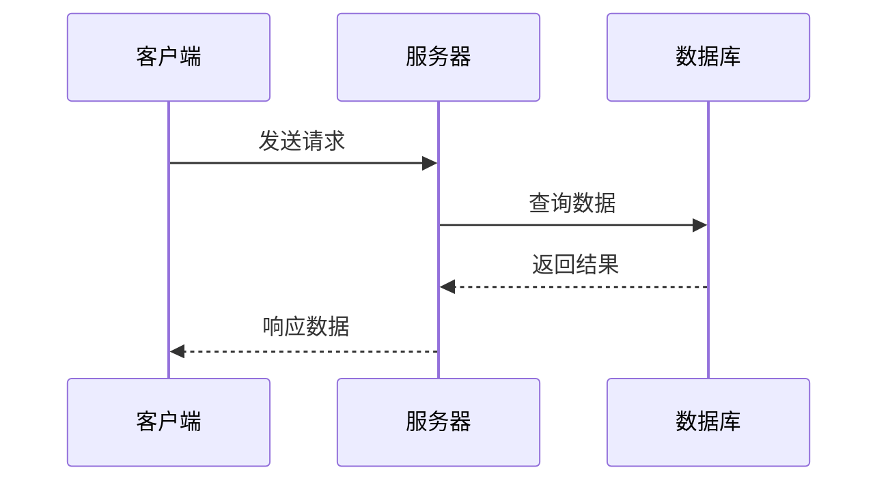

## 为什么用 Markdown 写作？

Markdown 是一种**轻量级标记语言**，用纯文本符号表达排版意图。相比 Word 或 LaTeX，它有几个关键优势：

- **专注内容而非排版** — 写作时不打断思路去调格式
- **纯文本可迁移** — 任何编辑器都能打开，不依赖特定软件
- **版本控制友好** — Git diff 可以清楚看到内容变化
- **可扩展** — 可以嵌入 HTML、LaTeX、Mermaid 图表等

本博客使用 Astro 的 Markdown/MDX 引擎，在标准 Markdown 基础上扩展了许多功能。

## 基础语法速查

### 标题

```markdown
# 一级标题
## 二级标题
### 三级标题
#### 四级标题
```

### 文字格式

```markdown
**粗体**  *斜体*  ~~删除线~~  `行内代码`
```

### 链接与图片

```markdown
[链接文字](https://example.com)

```

### 列表

无序列表使用 `-`、`*` 或 `+`：

```markdown
- 项目一
- 项目二
  - 嵌套项目
  - 另一个嵌套
```

有序列表使用数字：

```markdown
1. 第一步
2. 第二步
3. 第三步
```

## 代码块语法高亮

本博客使用 Expressive Code（基于 Shiki）进行代码高亮，支持明暗双主题。

使用三个反引号包裹代码，并指定语言：

````markdown
```python
def fibonacci(n: int) -> int:
    """计算第 n 个斐波那契数"""
    if n <= 1:
        return n
    a, b = 0, 1
    for _ in range(n - 1):
        a, b = b, a + b
    return b

for i in range(10):
    print(f"F({i}) = {fibonacci(i)}")
```
````

效果如下：

```python
def fibonacci(n: int) -> int:
    """计算第 n 个斐波那契数"""
    if n <= 1:
        return n
    a, b = 0, 1
    for _ in range(n - 1):
        a, b = b, a + b
    return b

for i in range(10):
    print(f"F({i}) = {fibonacci(i)}")
```

TypeScript 示例：

```typescript
interface BlogPost {
  title: string;
  published: Date;
  tags: string[];
  content: string;
}

function formatPost(post: BlogPost): string {
  return `[${post.published.toISOString()}] ${post.title}`;
}
```

### 代码块功能

- **行号**：自动显示行号
- **折叠**：长代码块可以折叠（点击标题栏切换）
- **复制按钮**：悬停时显示复制按钮
- **自动换行**：长代码行自动换行，无需横向滚动

## 数学公式

本博客使用 **KaTeX（服务端）+ MathJax 3（客户端）** 双重渲染方案。KaTeX 速度极快，MathJax 作为复杂公式的回退。

### 内联公式

用 `$...$` 包裹：$E = mc^2$，质能方程是物理学中最著名的公式之一。

复变函数中的柯西积分公式：$f(a) = \frac{1}{2\pi i} \oint_\gamma \frac{f(z)}{z-a} dz$

### 块级公式

用 `$$...$$` 包裹（各占一行）：

$$
\int_{-\infty}^{\infty} e^{-x^2} dx = \sqrt{\pi}
$$

### 矩阵

$$
\begin{bmatrix}
a & b \\
c & d
\end{bmatrix}
\begin{bmatrix}
x \\
y
\end{bmatrix}
=
\begin{bmatrix}
ax + by \\
cx + dy
\end{bmatrix}
$$

### 多行公式

$$
\begin{aligned}
\nabla \times \vec{\mathbf{B}} - \frac{1}{c} \frac{\partial \vec{\mathbf{E}}}{\partial t} &= \frac{4\pi}{c} \vec{\mathbf{j}} \\
\nabla \cdot \vec{\mathbf{E}} &= 4\pi \rho
\end{aligned}
$$

## 提示框（Admonitions）

本博客支持 5 种提示框，在标准 Markdown 之外：

```markdown
:::note
这是一个普通的提示信息。
:::

:::tip
这是一个建议或技巧。
:::

:::important
这是重要信息，需要注意。
:::

:::caution
这是警告，需要谨慎。
:::

:::warning
这是严重警告，需要特别注意。
:::
```

渲染效果如下：

:::note
这是一个普通的**提示信息**，用于补充说明。
:::

:::tip
这是一个**建议或技巧**，可以帮助你更好地完成任务。
:::

:::important
这是**重要信息**，请务必注意。
:::

:::caution
这是**警告**，操作前请仔细阅读说明。
:::

:::warning
这是**严重警告**，操作不当可能导致问题。
:::

### 兼容 GitHub 语法

本博客也支持 GitHub 风格的提示框，会自动转换：

```markdown
> [!NOTE]
> 这是一个 GitHub 风格的提示。
```

## Mermaid 图表

使用 ```` ```mermaid ```` 代码块绘制流程图、时序图等：

````markdown

````

效果：


时序图：



### 主题自适应

Mermaid 图表会自动跟随网站明暗主题切换——切换到暗色模式时图表也会变为暗色配色。

## 表格

| 框架 | 构建工具 | 渲染模式 | 适用场景 |
|------|----------|----------|----------|
| Astro | Vite | SSG/SSR | 内容网站 |
| Next.js | Turbopack | SSR/SSG | 全栈应用 |
| Nuxt | Vite | SSR/SSG | Vue 全栈 |
| SvelteKit | Vite | SSR/SSG | Svelte 全栈 |

表格在移动端会自动变为可横向滚动，不会破坏页面布局。

## 引用

> 这是一段引用文本。可以包含**粗体**、*斜体*等格式。

嵌套引用：

> 外层引用
>> 内层引用
>>> 更深层的引用

## 任务列表

- [x] 搭建博客框架
- [x] 配置主题与样式
- [x] 添加搜索功能
- [ ] 接入评论系统
- [ ] 添加友链页面

## 图片增强

### 基础图片


### 自定义宽度

本博客扩展了图片语法，可以在 alt text 中指定宽度和居中：

```markdown


```

- `w-400` — 宽度设为 400px
- `w-80%` — 宽度设为父容器的 80%
- `center` — 图片居中显示

### Github 仓库卡片

```markdown
:github[soren-abt/my-knowledge-base]
```

这会从 GitHub API 拉取仓库信息并渲染为信息卡片，包含 Stars、Forks、License、语言等信息。目前这个功能在构建时运行，所以不会影响页面加载性能。

## 分割线

使用 `---` 创建分割线：

---

## VSCode 写作配置

推荐在 VSCode 中安装以下插件获得更好的 Markdown 写作体验：

- **MDX** — 语法高亮和智能提示
- **Markdown Preview Enhanced** — 实时预览
- **Prettier** — 自动格式化
- **Markdownlint** — 语法规范检查

### 推荐设置

```json
{
  "editor.wordWrap": "on",
  "markdown.preview.breaks": true,
  "[markdown]": {
    "editor.formatOnSave": true
  }
}
```

## 写作建议

1. **合理使用标题层级** — 不要跳级（如 H2 后直接用 H4），保持嵌套逻辑清晰
2. **代码块标注语言** — ` ```python ` 而不是 ` ``` `，以获得正确的语法高亮
3. **段落之间留空行** — Markdown 用空行分隔段落，单个换行符会被忽略
4. **链接使用描述性文字** — 避免 "点击这里"，用有意义的链接文字
5. **图片添加 alt 描述** — 可访问性更好，SEO 也有帮助

## 总结

结合 Astro 的 remark/rehype 插件管道，本博客的 Markdown 能力远超标准规范。你可以用纯文本写出包含数学公式、图表、代码高亮、提示框的丰富内容。

以上就是本博客支持的全部 Markdown 语法和扩展功能。
