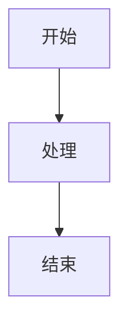

## 前言

本文是我从零开始构建 [Soren's Blog](https://soren-abt.github.io) 的完整记录。这个项目不仅仅是一个博客——它同时是一个知识库、一个音乐播放器、一个交互式 3D 体验空间。我花了大量时间打磨每一个细节，从架构设计到 CSS 动画到音频信号处理。

本文将详细记录整个搭建过程，包括技术选型、架构设计、核心功能实现、踩坑经验以及性能优化策略。全文超过两万字，建议收藏后分段阅读。

### 谁适合读这篇文章？

| 读者类型                         | 可以收获什么                                         |
| -------------------------------- | ---------------------------------------------------- |
| **初学者（正在学 HTML/CSS/JS）** | 了解一个完整项目从零到一的流程，学习如何组织前端代码 |
| **有一定基础（会用 React/Vue）** | 理解 Astro 的 Islands 架构思维，对比传统 SPA 框架    |
| **想搭建个人博客的学生**         | 获得完整的技术方案和部署指南，成本为零               |
| **对音频/DSP 感兴趣**            | 了解 Web Audio API 的信号链路实现                    |
| **只想要灵感/参考**              | 浏览架构设计和功能列表，提取你需要的部分             |

### 阅读建议

- **第 1-3 章**：必读，理解项目全貌和技术决策
- **第 4-5 章**：CSS 架构和音乐播放器，最深入的两个系统
- **第 7 章**：主题系统设计，可迁移到任何项目
- **第 17 章**：踩坑大全，节省你的调试时间
- **其他章节**：按需跳读，每个系统相对独立

### 搭建成本

作为学生，成本是一个很现实的考量。好消息是：**从开发到部署，以下所有工具全部免费**：

| 项目       | 工具/服务                    | 费用                     |
| ---------- | ---------------------------- | ------------------------ |
| 代码编辑器 | VS Code                      | 免费                     |
| 版本控制   | Git + GitHub                 | 免费                     |
| 托管部署   | GitHub Pages                 | 免费                     |
| CDN 加速   | Vercel / Cloudflare Pages    | 免费（有慷慨的免费额度） |
| 域名       | `github.io` 二级域名         | 免费                     |
| 搜索       | Pagefind（静态索引）         | 免费                     |
| 评论       | Giscus（GitHub Discussions） | 免费                     |
| 字体       | 开源字体（如霞鹜文楷）       | 免费                     |
| 字体 CDN   | Google Fonts / jsDelivr      | 免费                     |

也就是说，**从头到尾不需要花一分钱**。唯一可能需要付费的是自定义域名（可选，约 ¥50-100/年），但这不是必需的。

---

## 搭建这个博客教会我的事

在开始讲技术之前，我想先说说这个项目带给我的成长。作为本科生，在搭建过程中我学到了远比代码更多的东西：

- **系统设计思维** — 一个博客涉及路由、内容管理、样式架构、构建管道、部署流程……每个子系统都需要清晰的设计边界和接口
- **调试能力** — 从"为什么音乐不播放"到"为什么 Vite 死锁"，每个 bug 都是一次深入底层原理的机会
- **性能意识** — Lighthouse 评分不是目的，但追求满分的过程教会你什么是真正的性能优化
- **文档能力** — 把复杂的技术实现写清楚，本身就是一个高价值的技能训练
- **耐心** — 有些功能（如音乐播放器的 DSP 链）需要反复试错，这是课堂里学不到的

如果你也是在读学生，我强烈建议你动手做一个自己的项目——不是照着教程复制，而是从"我想要什么"出发，一个功能一个功能地实现。这种自驱的实践比任何课程作业都更能提升工程能力。

---

## 一、项目概述

### 1.1 核心目标

- **博客** —— 发布技术文章，支持 Markdown/MDX 编写
- **知识库** —— 整理学习笔记（数学、物理、研究），支持 PDF 嵌入
- **音乐播放器** —— 展示个人收藏的 Hi-Res 无损音乐
- **高性能** —— 静态生成，Lighthouse 满分
- **个性化** —— 自定义主题色、壁纸、粒子特效

### 1.2 技术栈速览

| 类别     | 技术                                | 说明                      |
| -------- | ----------------------------------- | ------------------------- |
| 框架     | Astro 6                             | 静态站点生成，输出纯 HTML |
| 样式     | Tailwind CSS 4 + OKLCH              | 原子化 CSS + 动态主题色   |
| 代码高亮 | Expressive Code / Shiki             | 支持明暗双主题            |
| 数学公式 | KaTeX (服务端) + MathJax 3 (客户端) | 双重渲染保障              |
| 图表     | Mermaid                             | 客户端 CDN 渲染           |
| 搜索     | Pagefind                            | 静态全文搜索              |
| 3D       | Three.js 0.160                      | 欢迎页交互式背景          |
| 部署     | GitHub Pages + Vercel 加速          | 双部署策略                |
| 字体     | JetBrains Mono + LXGW WenKai        | 自托管 + CDN 回退         |
| 音频     | Web Audio API + music-metadata      | Hi-Res FLAC 播放          |

### 1.3 目录结构

```
my-knowledge-base/
├── astro.config.ts              # Astro 配置（核心大脑）
├── package.json                 # 依赖与脚本
├── pagefind.yml                 # 搜索引擎配置
├── vercel.json                  # Vercel 部署与安全头
├── public/
│   ├── assets/
│   │   ├── font/                # 自托管字体
│   │   ├── music/
│   │   │   ├── url/             # 10 首 FLAC 音频
│   │   │   └── cover/           # 自动提取的专辑封面
│   │   └── wallpaper/           # 桌面+移动端壁纸
│   └── js/
│       ├── app.js               # 主应用逻辑
│       ├── music-player*.js     # 音乐播放器引擎模块
│       ├── sakura.js            # 樱花粒子效果
│       ├── welcome-3d.js        # Three.js 3D 场景
│       └── mermaid-render.js    # Mermaid 图表渲染
├── src/
│   ├── config/                  # 站点配置（9 个文件）
│   ├── content/
│   │   ├── posts/               # 博客文章（.md）
│   │   └── docs/files/          # 知识库文档
│   ├── content.config.ts        # Zod 内容校验
│   ├── layouts/
│   │   ├── Layout.astro         # 主布局（所有内容页）
│   │   └── WelcomeLayout.astro  # 欢迎页布局（极简）
│   ├── pages/                   # 12 个页面
│   ├── components/              # 18 个组件
│   ├── plugins/                 # 12 个 remark/rehype 插件
│   ├── styles/                  # CSS 架构（7 层 + 子模块）
│   ├── types/                   # TypeScript 类型定义
│   └── utils/                   # 工具函数
└── scripts/
    ├── scan-music.mjs           # 音乐元数据扫描器
    ├── audio-decoder.mjs        # 音频解码器模型
    └── tag-reader.mjs           # 标签读取器
```

---

## 二、技术选型深度解析

### 2.1 为什么选择 Astro 而不是 Next.js 或 Hugo？

**Astro 的核心优势是零 JS 输出（Islands Architecture）。** 我的博客内容以文字为主，不需要 React/Vue 的运行时。Astro 在构建时将组件渲染为纯 HTML，只在需要交互的地方加载 JS（如音乐播放器、搜索框）。

与 Next.js 的对比：

- Next.js 即使生成静态页面，也会携带 React 运行时（~130KB）
- Astro 的 `.astro` 组件编译后输出零 JS，性能极佳
- Astro 支持在 Markdown 中使用组件（MDX），这对知识库的交互式文档很重要

与 Hugo 的对比：

- Hugo 模板语法功能有限，想做音乐播放器 UI 很困难
- Astro 使用 JSX 风格的模板，前端开发者上手快
- Astro 生态更好（Vite 插件、remark/rehype 管道）

### 2.2 为什么选择 Tailwind CSS 4 而不是其他方案？

Tailwind CSS 4 带来了几个关键改进：

- **OKLCH 色彩空间**：使用 `oklch()` 函数定义颜色，比 HSL 更符合人眼感知，可以只用一条 `--hue` 变量控制整个色彩体系
- **Vite 原生集成**：通过 `@tailwindcss/vite` 插件，零配置
- **CSS-first 配置**：可以用 CSS `@theme` 代替 JS 配置

我的设计令牌系统只用一个 `--hue` 控制全站颜色：

```css
:root {
  --hue: 250; /* 紫蓝色 */
  --primary: oklch(65% 0.25 var(--hue));
  --primary-light: oklch(75% 0.2 var(--hue));
  --page-bg: oklch(98% 0.005 var(--hue));
}
.dark {
  --primary: oklch(70% 0.22 var(--hue));
  --page-bg: oklch(18% 0.01 var(--hue));
}
```

用户可以在设置面板中拖动滑块改变 `--hue`，整个站的色调会实时变化，包括代码块、卡片、按钮等所有 UI 元素。

### 2.3 为什么用 Pagefind 而不是 Algolia？

- **零成本**：Pagefind 在构建时生成索引，无需第三方服务
- **隐私友好**：搜索完全在客户端进行，不发送请求到外部
- **中文支持好**：Pagefind 对 CJK 字符有专门的分词处理
- **配置简单**：一个 `pagefind.yml` 文件，排除不需要索引的区域

### 2.4 为什么自托管字体？

我的博客使用了两种特殊字体：

- **JetBrains Mono Nerd Font**：用于代码块和音乐播放器的时间显示，包含编程连字（ligatures）和 Nerd Font 图标
- **LXGW WenKai**（霞鹜文楷）：一款高质量的开源中文楷体字体，适合正文阅读

自托管的好处：

- 避免 Google Fonts 的额外 DNS 查询
- 控制字体加载策略（`font-display: swap` 防止 FOIT）
- 使用 `subset` 减小字体体积

---

## 三、Astro 配置详解

`astro.config.ts` 是整个项目的核心配置文件。以下逐段解析：

### 3.1 站点基础配置

```typescript
export default defineConfig({
  site: "https://soren-abt.github.io",
  output: "static",
  trailingSlash: "always",
  // ...
});
```

- `output: "static"`：生成纯 HTML，不依赖 Node.js 服务端
- `trailingSlash: "always"`：所有 URL 以 `/` 结尾，与 GitHub Pages 兼容

### 3.2 集成

```typescript
integrations: [
  sitemap(),
  expressiveCode({ /* ... */ }),
  mdx(),
],
```

#### Sitemap

自动生成 `sitemap-index.xml` 和分页 sitemap，方便搜索引擎爬取。

#### Expressive Code（代码高亮）

```typescript
expressiveCode({
  themes: ["github-light", "github-dark"],
  plugins: [pluginCollapsibleSections(), pluginLineNumbers()],
  defaultProps: {
    wrap: true, // 长代码自动换行
    overridesByLang: {
      ansi: { wrap: false }, // 终端输出不换行
    },
  },
  styleOverrides: {
    codeFontFamily: "JetBrainsMono Nerd Font, JetBrains Mono Variable, monospace",
    borderRadius: "0.5rem",
  },
});
```

Expressive Code 是基于 Shiki 的增强版代码高亮引擎。我启用了：

- **可折叠代码块**：长代码可以点击折叠
- **行号**：自动显示行号
- **自定义字体**：使用 Nerd Font 包含图标字符
- **明暗双主题**：自动跟随系统主题切换

#### MDX

MDX 允许在 Markdown 中使用 Astro 组件，对于知识库中的交互式图表非常有用。

### 3.3 Remark 插件管道

Remark 是 Markdown → HTML 转换的第一阶段（AST 处理）：

```
Markdown → remarkParse → [remarkMath] → [remarkReadingTime]
→ [remarkFixGithubAdmonitions] → [remarkDirective] → [parseDirectiveNode]
→ [remarkMermaid] → remarkRehype → [rehype 插件] → HTML
```

#### remarkMath

解析 LaTeX 数学公式：

```markdown
行内公式 $E = mc^2$
块级公式 $$\int_0^\infty e^{-x^2} dx = \frac{\sqrt{\pi}}{2}$$
```

#### remarkReadingTime（自定义）

CJK 感知的阅读时间计算。中文每分钟 400 字，英文每分钟 200 词：

```javascript
// 核心逻辑
const chineseChars = text.match(/[一-鿿㐀-䶿]/g) || [];
const englishWords = text.match(/[a-zA-Z]+/g) || [];
const minutes = Math.ceil(chineseChars.length / 400 + englishWords.length / 200);
```

然后将 `minutes` 和 `words` 注入到 frontmatter 中，前端可以直接展示。

#### remarkFixGithubAdmonitions（自定义）

自动将 GitHub 风格的 `> [!NOTE]` 语法转换为 Astro 的 `:::note` 指令语法，兼容两种写作习惯。

#### remarkDirective

解析 `:::directive` 语法块：

```markdown
:::note
这是一个提示框
:::

:::warning{title="注意"}
这是警告
:::
```

#### parseDirectiveNode（自定义）

将 directive 节点从 remark AST 转换为 rehype AST（HTML 节点树），使得 admonition 组件可以渲染为 HTML。

#### remarkMermaid（自定义）

将 ````mermaid` 代码块转换为特殊的 HTML 容器，由客户端 JS 加载 Mermaid 库进行渲染：

````markdown

````

````

### 3.4 Rehype 插件管道

Rehype 是 HTML AST 的处理阶段：

#### rehypeKatex

将服务端渲染的 LaTeX 公式转为 HTML + CSS。KaTeX 比 MathJax 快得多（服务端渲染，不需要 JS），但复杂公式可能渲染不完整，所以同时加载 MathJax 作为客户端回退。

#### rehypeWrapTable（自定义）

自动将 `<table>` 包裹在可滚动的 `<div>` 中，解决移动端表格溢出问题。

#### rehypeMermaid（自定义）

将 Mermaid 容器转为客户端可渲染的格式。

#### rehypeImageWidth（自定义）

支持 Markdown 图片的自定义宽度：

```markdown


````

实现原理：解析 alt text 中的宽度参数，设置 `style="width: 80%"`。

#### rehypeComponents

注册 6 个自定义组件：

| 组件                        | 用途                            |
| --------------------------- | ------------------------------- |
| `<github repo="user/repo">` | GitHub 仓库卡片（动态拉取 API） |
| `<note>`                    | 蓝色信息提示框                  |
| `<tip>`                     | 绿色建议提示框                  |
| `<important>`               | 橙色重要提示框                  |
| `<caution>`                 | 黄色警告框                      |
| `<warning>`                 | 红色严重警告框                  |

GitHub 组件最有趣——它从 GitHub API 实时拉取仓库信息（Stars、Forks、License、Language、Description），渲染成卡片：

```typescript
// 在 rehype 阶段发起 fetch
const res = await fetch(`https://api.github.com/repos/${repo}`);
const data = await res.json();
// 渲染为 HTML 卡片
```

---

## 四、CSS 架构：七层设计系统

### 4.1 总览

```
global.css          # 入口：Tailwind 指令 + 导入所有层
├── design-tokens.css   # 第 1 层：OKLCH 色彩令牌
├── base.css            # 第 2 层：HTML 元素 + 工具类
├── components.css      # 第 3 层：组件样式
│   ├── components/cards.css
│   ├── components/prose.css
│   ├── components/code-blocks.css
│   ├── components/navbar.css
│   └── components/widgets.css
├── expressive-code.css # 第 4 层：代码高亮覆盖
├── panels.css          # 第 5 层：面板样式
│   ├── panels/search.css
│   ├── panels/lightbox.css
│   ├── panels/toc.css
│   └── panels/settings.css
├── animations.css      # 第 6 层：关键帧动画
└── 字体声明             # 第 7 层：自托管字体
```

### 4.2 设计令牌（design-tokens.css）—— 237 行

这是整个视觉系统的基石。核心思路：**所有颜色都由一个 `--hue` CSS 变量派生。**

```css
:root {
  --hue: 250;

  /* 主色调 */
  --primary: oklch(65% 0.25 var(--hue));
  --primary-hover: oklch(60% 0.28 var(--hue));
  --primary-light: oklch(75% 0.2 var(--hue));
  --primary-bg: oklch(95% 0.03 var(--hue));

  /* 背景层级 */
  --page-bg: oklch(98% 0.005 var(--hue));
  --card-bg: oklch(100% 0 0);
  --card-bg-hover: oklch(96% 0.008 var(--hue));

  /* 文字层级 */
  --text-1: oklch(15% 0.02 var(--hue));
  --text-2: oklch(35% 0.03 var(--hue));
  --text-3: oklch(55% 0.02 var(--hue));

  /* 边框 */
  --border-1: oklch(88% 0.01 var(--hue));
  --border-2: oklch(93% 0.005 var(--hue));

  /* 阴影（4 个层级） */
  --shadow-xs: 0 1px 2px oklch(0% 0 0 / 0.05);
  --shadow-sm: 0 1px 3px oklch(0% 0 0 / 0.08), 0 1px 2px oklch(0% 0 0 / 0.06);
  --shadow-md: 0 4px 6px oklch(0% 0 0 / 0.07), 0 2px 4px oklch(0% 0 0 / 0.06);
  --shadow-lg: 0 10px 15px oklch(0% 0 0 / 0.1), 0 4px 6px oklch(0% 0 0 / 0.05);
}

.dark {
  --primary: oklch(70% 0.22 var(--hue));
  --page-bg: oklch(18% 0.01 var(--hue));
  --card-bg: oklch(22% 0.015 var(--hue));
  --text-1: oklch(92% 0.01 var(--hue));
  --text-2: oklch(75% 0.02 var(--hue));
  --text-3: oklch(55% 0.02 var(--hue));
  /* ... 暗色模式所有令牌 */
}
```

使用 OKLCH 的好处：

- **感知均匀**：改变亮度值时，视觉变化是线性的
- **色相独立**：改变 `--hue` 不会影响亮度感知
- **广色域**：支持 P3 色彩空间，颜色更鲜艳

### 4.3 毛玻璃效果系统

壁纸模式下，卡片会变成半透明毛玻璃：

```css
body.wallpaper-transparent .glass-card {
  background: oklch(from var(--card-bg) l c h / 0.65);
  backdrop-filter: blur(16px) saturate(1.2);
  border: 1px solid oklch(from var(--border-1) l c h / 0.3);
}
```

`oklch(from ... l c h / alpha)` 语法可以从已有颜色派生新的透明度版本，这在 Tailwind 4 中是新特性。

### 4.4 View Transitions 动画

Astro 的 View Transitions API 用于页面切换动画：

```css
@view-transition {
  navigation: auto;
}

::view-transition-old(root) {
  animation: fade-out 0.3s ease-out forwards;
}

::view-transition-new(root) {
  animation: fade-in-up 0.4s ease-out forwards;
}

@keyframes fade-in-up {
  from {
    opacity: 0;
    transform: translateY(8px);
  }
  to {
    opacity: 1;
    transform: translateY(0);
  }
}
```

页面切换时有 300ms 的淡出和 400ms 的淡入加轻微上移效果，感觉非常流畅。

---

## 五、音乐播放器系统

这是我投入精力最多的功能。灵感来自 Apple Music 的界面和 Roon 的音频处理理念。

### 5.1 构建时：音乐元数据扫描（scripts/scan-music.mjs）

每次 `dev` 或 `build` 时，脚本会：

1. **扫描音频文件**：递归遍历 `public/assets/music/url/`，支持 20+ 格式
2. **读取元数据**：使用 `music-metadata` 库解析 FLAC 标签（标题、艺术家、专辑、年份、流派、作曲者、曲目号、ReplayGain 等）
3. **提取封面**：从音频文件中提取嵌入的封面图片，保存到 `public/assets/music/cover/`
4. **格式检测**：通过 magic bytes 检测真实编码格式（不依赖文件扩展名）
5. **质量分级**：自动分类为 7 个等级

   ```
   Studio Master       > 96kHz/24bit
   Hi-Res 无损         > 48kHz/24bit
   CD 质量             = 44.1kHz/16bit
   标准无损            = 44.1kHz/16bit (其他格式)
   高码率有损          > 256kbps
   标准有损            > 128kbps
   低码率有损          < 128kbps
   ```

6. **输出生成**：
   - `src/config/musicPlaylist.generated.ts`（TypeScript，服务端使用）
   - `public/api/music-playlist.json`（JSON，客户端可拉取）
7. **--watch 模式**：监听文件变化，自动重新扫描

### 5.2 音频解码器模型（scripts/audio-decoder.mjs）

这是一个 635 行的综合音频解码器知识库，参考了 foobar2000 的解码器架构和 Roon 的信号路径：

- **Magic byte 检测**：支持 15+ 音频格式（FLAC, ALAC, WAV, AIFF, WavPack, Monkey's Audio, TAK, TTA, MP3, AAC, Ogg Vorbis, Opus, Musepack, WMA, AC3, DTS）
- **浏览器兼容性矩阵**：每种格式在不同浏览器中的支持情况
- **信号路径构建**：`Source → Decoder → Properties → Quality → Downsampling → Output`
- **转码建议**：对不支持的格式推荐替代方案

### 5.3 高级标签读取器（scripts/tag-reader.mjs）

584 行的标签读取器，灵感来自 foobar2000、Roon 和 Navidrome：

- **流派规范化**：将各种流派标签映射到标准分类（Pop, Rock, Metal, Electronic, Jazz, Classical, Soundtrack, Hip-Hop 等）
- **多值字段解析**：正确处理用 `/`、`;`、`feat.`、`&` 分隔的艺术家名单
- **语言检测**：通过 Unicode 范围检测标题/艺术家的语言（CJK vs Latin）
- **ReplayGain 提取**：支持 6 种增益标签（track/album gain + peak）
- **封面分类**：前封面/封底/小册子/艺术家

### 5.4 播放器引擎（public/js/music-player.js）

核心引擎是一个 **IIFE 单例模式**（`window.__musicPlayer`），约 930 行。

**架构设计：**

```
State (单一状态树)
  ├── playlist, currentIndex, currentSong
  ├── isPlaying, isLoading, currentTime, duration
  ├── volume, isMuted, isShuffled, isRepeating
  ├── playQueue, replayGainMode
  └── DSP state (headroom, compressor, crossfeed)

Audio Pipeline (Web Audio API)
  MediaElementSource → ReplayGain → Headroom → Compressor
    → [Crossfeed | Bypass] → Analyser → Destination

Broadcast (发布-订阅)
  state 变化 → broadcast() → listeners.forEach(fn)
    → window CustomEvent
```

**Web Audio API 信号链路：**

这是完全按照 foobar2000 和 Roon 理念构建的 DSP 信号链：

```
1. MediaElementSource   # 从 <audio> 元素获取音频
2. GainNode (ReplayGain) # 响度均衡
3. GainNode (Headroom)   # -3dB 动态余量（防止削波）
4. DynamicsCompressor   # 动态压缩（Threshold, Ratio, Attack, Release）
5. [Crossfeed 分路]     # Bauer 电路模拟（耳机听感优化）
   ├── L → DryL → Merger[0]
   ├── L → LowPass(700Hz) → Gain(-9dB) → Merger[1]  # L→R 串扰
   ├── R → DryR → Merger[1]
   └── R → LowPass(700Hz) → Gain(-9dB) → Merger[0]  # R→L 串扰
6. AnalyserNode         # 频谱可视化（FFT size=256）
7. AudioDestination     # 最终输出
```

**DSP 预设：** 支持 6 种预设（off, classical, rock, jazz, headphones, voice），Ctrl+Shift+D 循环切换。

**音频格式信息展示（foobar2000/Roon 风格）：**

播放器 UI 会显示：

- 编解码器（FLAC → "FLAC · 96kHz · 24bit"）
- 质量徽章（"HR" = Hi-Res 无损，"SM" = Studio Master）
- 信号路径（"FLAC → 96kHz/24bit → RG(Track Gain) → Output"）
- 比特率（"4615 kbps"）

### 5.5 播放器 UI（src/components/MusicPlayer.astro）

播放器 UI 有三个层次：

#### 第一层：FAB 浮动按钮 + 迷你面板

- **FAB 按钮**：固定定位在左下角，带音乐图标和播放中圆点指示器
- **迷你面板**：点击 FAB 弹出，包含专辑封面、歌曲信息、进度条、完整播放控制

#### 第二层：音乐库浏览器（Apple Music 风格）

- **全屏叠加层**，带毛玻璃背景
- **侧边栏**：浏览、专辑、艺术家、流派、年份、歌曲分类导航
- **内容区**：瀑布流网格布局、横向滚动轮播、卡片悬停效果
- **搜索/排序/筛选**：实时过滤、多种排序方式
- **专辑详情**：大封面、曲目列表、碟片分隔线
- **迷你播放栏**：底部常驻，显示当前播放曲目
- **右键菜单**：添加到队列、收藏等

#### 第三层：沉浸式全屏播放（Roon 风格）

- **双层背景**：当前封面 + 下一首封面的交叉淡入淡出（30px 模糊 + 35% 亮度 + 1.3x 饱和度）
- **暗色渐变叠加层**：中心透明、边缘暗色
- **大尺寸专辑封面**：响应式 `min(38vh, 38vw, 360px)`
- **频谱可视化**：48px 高度 Canvas
- **毛玻璃控制按钮**

### 5.6 播放列表内容

当前收录 10 首 FLAC 格式曲目：

| 曲目                     | 艺术家                      | 专辑                 | 采样率      | 质量          |
| ------------------------ | --------------------------- | -------------------- | ----------- | ------------- |
| JANE DOE                 | 米津玄師 feat. 宇多田ヒカル | JANE DOE             | 48kHz/24bit | Hi-Res        |
| A Most Profaned Fragment | 祖堅正慶                    | FFXVI DLC OST        | 96kHz/24bit | Studio Master |
| Cascade                  | 祖堅正慶 feat. 植松伸夫     | FFXVI DLC OST        | 96kHz/24bit | Studio Master |
| Old Stories              | Kevin Penkin                | Made in Abyss S2 OST | 96kHz/24bit | Studio Master |
| XI                       | 澤野弘之                    | Gundam Hathaway OST  | 96kHz/24bit | Studio Master |
| 天より降りし力           | 祖堅正慶                    | FFXIV ARR OST        | 96kHz/24bit | Studio Master |
| EARth                    | 澤野弘之                    | Gundam Hathaway OST  | 96kHz/24bit | Studio Master |
| 星と僕らと               | 目黒将司                    | Persona 5 OST        | 48kHz/24bit | Hi-Res        |
| God knows...             | 涼宮ハルヒ(CV.平野綾)       | 涼宮ハルヒの完奏     | 96kHz/24bit | Studio Master |
| AD ASTRA                 | STARSET                     | SILOS                | 48kHz/24bit | Hi-Res        |

### 5.7 音乐播放器踩坑记录

#### 坑 #1：`audio.load()` 取消 `play()`

**问题**：切换歌曲后不播放。

**原因**：HTML5 Audio 的 `.load()` 方法会取消所有待处理操作。代码中先设置了 `audio.src`（浏览器自动开始加载），然后调用 `audio.load()`（强制重新加载），导致 `loadeddata` 可能触发两次，第一次的 `play()` 被第二次加载取消。

**解决**：移除 `audio.load()` 调用。设置 `audio.src` 就足以触发加载。

#### 坑 #2：`willAutoPlay` 竞态条件

**问题**：`loadeddata` 事件可能在 `willAutoPlay = true` 之前同步触发（某些浏览器中设置 `audio.src` 会同步触发事件）。此时 `willAutoPlay` 还是 `undefined`，`play()` 不被调用。

**解决**：改为直接在用户手势处理函数中调用 `audio.play()`。因为 `play()` 在用户点击事件中同步调用，不受自动播放策略限制。

#### 坑 #3：UI 中 `player` 变量作用域错误

**问题**：`updateUI()` 函数中使用了 `player.getDspChain()`，但 `player` 在 `updateUI` 的作用域中未定义（它只是 `setup()` 函数的参数）。这导致 `ReferenceError`，阻止了时长显示、进度条填充等后续代码的执行。

**解决**：改为 `window.__musicPlayer.getDspChain()`。

#### 坑 #4：FLAC 文件 `audio.duration` 为 NaN

**问题**：某些浏览器加载 FLAC 时，`loadeddata` 事件触发后 `audio.duration` 仍为 `NaN`。

**解决**：从元数据中预先读取时长（构建时），在 `state.duration` 中始终有回落值。`loadeddata` 只做增量更新。

---

## 六、布局系统

### 6.1 Layout.astro —— 全功能布局

`Layout.astro` 是所有内容页（博客文章、归档、标签、知识库、关于页、搜索页）的容器。它包含：

```
<head>
  ├── Meta 标签（charset, viewport, OG, Twitter Card）
  ├── ThemeScript（主题管理，Mizuki 模式）
  ├── CoreManager（集中式事件委托）
  ├── Google Fonts（JetBrains Mono）
  ├── CDN 预连接（jsdelivr, unpkg）
  ├── RSS 链接
  ├── ClientRouter（Astro View Transitions）
  └── MathJax 3 配置 + 延迟加载器（双 CDN 回退链）
<body>
  ├── 壁纸预加载内联脚本（防止 FOUC）
  ├── 顶部渐变高亮（透明导航栏模式）
  ├── FullscreenWallpaper（壁纸轮播）
  ├── 波浪过渡画布 (#theme-wave-canvas)
  ├── 樱花粒子画布 (#sakura-canvas)
  ├── MusicPlayer（音乐播放器完整 UI）
  ├── 页面进度条
  ├── Navbar（粘性，毛玻璃/透明模式）
  ├── <main>（淡入过渡动画）
  │   └── <slot />（页面内容）
  ├── Footer
  ├── Toast 容器
  ├── 返回顶部按钮（环形进度指示）
  ├── FloatingTOC（浮动目录）
  ├── SettingsPanel（设置面板）
  ├── SearchModal（Ctrl+K 触发）
  ├── ImageLightbox（图片灯箱）
  ├── LinkPreviewCard（链接预览）
  ├── ShortcutsPanel（快捷键帮助）
  ├── 外部 JS（app.js, sakura.js, music-player*.js, mermaid-render.js）
  ├── MathJax 重渲染监听（astro:after-swap）
  └── ConfigCarrier（服务端配置 → 客户端）
```

### 6.2 WelcomeLayout.astro —— 极简布局

欢迎页使用独立的极简布局，移除了导航栏、页脚、音乐播放器、搜索、设置面板等所有功能组件，只保留：

- ThemeScript 和 CoreManager
- 波浪画布（主题过渡动画）
- 加载动画（3D 三角形 + 鼠标视差倾斜）
- 音乐引擎脚本（预加载，保持跨页导航状态）

### 6.3 Astro View Transitions 集成

项目使用 Astro 的 `<ClientRouter />` 实现页面无缝切换。

**astro:before-swap 处理：**

- MusicPlayer：保存当前播放状态（歌曲索引 + 播放位置）
- CoreManager：暂存 UI 状态

**astro:after-swap 处理：**

- MusicPlayer：恢复音频元素，重新加载歌曲（如果是同一首歌则保持播放进度；如果播放中则自动继续）
- CoreManager：从 localStorage 重新同步 UI 状态（主题、壁纸、设置）
- Layout：触发 MathJax 重新渲染数学公式

**导航去重脚本：**
防止 ClientRouter 重复导航到同一个 URL（比较 pathname + search + hash + origin），减少不必要的过渡动画。

---

## 七、主题系统（Mizuki 模式）

主题系统是整个 UI 的核心基础设施。我参考了一套被称为 "Mizuki 模式" 的设计架构。

### 7.1 单一真相来源（Single Source of Truth）

```
ThemeScript.astro（唯一修改 html.dark 的地方）
    ↓
window.__theme = {
    get: () => document.documentElement.classList.contains('dark'),
    set: (isDark) => { /* 修改 DOM + localStorage */ },
    toggle: () => { /* 切换 */ }
}
    ↓
其他组件通过 window.__theme API 操作主题
    ↓
theme-change CustomEvent（仅在手动切换时触发，不在导航同步时触发）
```

核心规则：

- **只有 `ThemeScript.astro` 可以直接修改 `html.dark` 类**
- 所有其他组件（导航栏、设置面板、快捷键）通过 `window.__theme` API 间接操作
- `theme-change` 自定义事件只在用户手动切换时触发，页面导航重新同步时不触发（避免动画闪烁）

### 7.2 CoreManager：集中式事件委托

`CoreManager.astro` 实现了所有交互功能的集中式事件委托。它监听 `document` 和 `window` 上的事件，统一管理和分发：

```javascript
// 伪代码
document.addEventListener("click", function (e) {
  if (e.target.matches("[data-theme-toggle]")) {
    window.__theme.toggle();
  }
  if (e.target.matches("[data-search-trigger]")) {
    openSearchModal();
  }
  if (e.target.matches("[data-settings-trigger]")) {
    openSettingsPanel();
  }
  // ... 更多委托
});
```

集中式委托的好处：

- 事件监听器在 ClientRouter 导航中幸存（不会重复绑定）
- 减少内存泄漏风险
- 统一的生命周期管理

### 7.3 波浪主题过渡动画

切换主题时，会触发一个 Canvas 波浪过渡效果：

```
波浪参数：
  - 多谐波正弦波（基频 + 2 次 + 3 次谐波）
  - 渐变填充（主题色渐变，带阴影）
  - 高亮线条（波浪顶部发光线）
  - 1 秒过渡，ease-out 缓动
```

---

## 八、页面详解

### 8.1 欢迎页（index.astro）

一个全屏交互式 3D 体验页面：

**Three.js 3D 场景** (`public/js/welcome-3d.js`)：

- 线框几何体（Wireframe Geometry），缓慢旋转
- 鼠标交互（视差效果 + 缩放）
- 日夜切换按钮

**自定义鼠标光标**：

- 系统光标完全隐藏（`cursor: none`）
- 6px 彩色圆点替代，带辉光阴影
- 悬停时放大到 2.2 倍
- 点击时产生涟漪动画

**UI 元素**：

- 站点标题：每个字符独立的上升动画（stagger delay）
- 时间感知问候语：打字机效果（"早上好"、"下午好"、"晚上好"）
- 毛玻璃按钮：开始阅读 + GitHub 链接
- 缩放 HUD：底部显示缩放级别
- 底部信息面板：滑入动画
- 滚动提示点：三个弹跳圆点

### 8.2 关于页（about.astro）

展示个人资料和技术栈：

- 个人卡片（头像/首字母、名字、简介、社交链接）
- 统计网格（文章数、标签数、总字数），使用 Astro 的 `getCollection()` 在构建时计算
- 技术栈网格（Astro 6、Tailwind CSS 4、Three.js、MathJax、GitHub Pages、Vercel、Markdown、RSS）

### 8.3 搜索页（search.astro）

使用 Pagefind 实现：

```javascript
// 动态加载 Pagefind
const pagefind = await import("/pagefind/pagefind.js");
await pagefind.options({ baseUrl: "/" });
// 搜索
const search = await pagefind.search(query);
// 加载结果
const results = await Promise.all(search.results.slice(0, 20).map((r) => r.data()));
```

- 防抖输入（250ms）
- 最多 20 条结果
- 结果高亮匹配词
- 响应式设计

### 8.4 归档页（archive.astro）

按年份分组的文章时间线：

- 年份徽章（渐变背景）
- 左侧竖线连接
- 4 个统计数字（总文章数、年份范围、最新年份、今年文章数）

### 8.5 博客列表与文章页

**列表页**（posts/index.astro）：

- 置顶文章优先
- Top 10 标签作为筛选芯片
- 响应式卡片网格（`auto-fill, minmax(320px, 1fr)`）
- 统计行（文章数、标签数、总字数、当前页）
- 分页组件（6 篇/页）

**文章页**（posts/[...slug].astro）：

- JSON-LD 结构化数据（BlogPosting Schema）用于 SEO
- 标签 → 标题 → 描述 → 元数据栏（发布日期、更新日期、分类、字数、阅读时间）
- 可选封面图
- 双栏布局：主内容 + 侧边栏
- 毛玻璃卡片效果（壁纸模式）
- 底部署名（CC BY-NC-SA 4.0 许可）
- 标签列表
- 上一篇/下一篇导航
- 桌面端侧边栏：目录 + 文章信息

### 8.6 标签系统

- **标签云**（tags/index.astro）：按频率排序，可点击的标签卡片
- **标签筛选**（tags/[tag].astro）：使用 `getStaticPaths()` 为每个标签生成独立页面

---

## 九、知识库系统

知识库是一个独立的文档集合，使用 Astro 的 Content Collections 管理。

### 9.1 目录结构

```
src/content/docs/files/
├── complex-analysis/          # 复分析笔记
│   ├── chapter2/              # 第 2 章
│   ├── chapter3/              # 第 3 章
│   ├── chapter4/              # 第 4 章
│   ├── chapter5/              # 第 5 章
│   └── chapter7/              # 第 7 章
├── general-physics-a1/        # 普通物理
│   └── mechanics/             # 力学复习
├── mathematical-modeling/     # 数学建模
│   ├── paper-guide.md         # 论文写作指南
│   └── *.pdf                  # 参考论文
├── research/                  # 研究方向
│   └── amc-note.md            # AMC 研究笔记
├── papers/                    # 论文
├── 读书笔记/                  # 读书笔记
└── 其他/                      # 其他资料
```

### 9.2 知识库特性

- **自动分类**：从目录结构提取分类
- **侧边栏导航**：分类展示，粘性定位
- **文档索引**：按分类分组，字符徽章
- **双栏布局**：文档内容 + 侧边导航
- **PDF 支持**：引用外部 PDF 文件

---

## 十、字体排版系统

### 10.1 字体选择

| 用途     | 字体                          | 格式  | 加载方式         |
| -------- | ----------------------------- | ----- | ---------------- |
| 正文/UI  | LXGW WenKai（霞鹜文楷）       | woff2 | 自托管           |
| 代码块   | JetBrainsMono Nerd Font       | woff2 | 自托管           |
| 回退代码 | JetBrains Mono Variable       | woff2 | Google Fonts CDN |
| 系统回退 | Microsoft YaHei, Noto Sans SC | —     | 系统字体         |

### 10.2 字体加载策略

```css
@font-face {
  font-family: "LXGWWenKai";
  src: url("/assets/font/LXGWWenKai-Regular.woff2") format("woff2");
  font-display: swap; /* 先用系统字体，加载完再替换 */
  font-weight: 400;
}

@font-face {
  font-family: "JetBrainsMono Nerd Font";
  src: url("/assets/font/JetBrainsMonoNerdFont-Regular.woff2") format("woff2");
  font-display: swap;
  font-weight: 400;
}
```

使用 `font-display: swap` 策略：页面先用回退字体渲染，自定义字体加载完成后无缝替换。这消除了 FOIT（Flash of Invisible Text）。

---

## 十一、SEO 优化

### 11.1 Open Graph + Twitter Card

每个页面动态生成 OG 标签：

```astro
<meta property="og:title" content={title} />
<meta property="og:description" content={description} />
<meta property="og:image" content={ogImageUrl} />
<meta property="og:type" content="article" />
<meta name="twitter:card" content="summary_large_image" />
```

### 11.2 JSON-LD 结构化数据

文章页注入 `BlogPosting` schema：

```json
{
  "@context": "https://schema.org",
  "@type": "BlogPosting",
  "headline": "文章标题",
  "datePublished": "2026-06-07",
  "dateModified": "2026-06-07",
  "author": { "@type": "Person", "name": "Soren" },
  "description": "文章描述",
  "keywords": ["Astro", "前端", "教程"]
}
```

### 11.3 OG 图片生成

使用 Vercel 的 Satori 库在构建时生成 OG 图片：

```typescript
// astro.config.ts
generateOgImages: true;
```

Satori 使用 JSX → SVG → PNG 的管道，无需无头浏览器。

### 11.4 Sitemap + RSS

- `@astrojs/sitemap` 自动生成 `sitemap-index.xml`
- `@astrojs/rss` 生成 RSS 2.0 订阅源

---

## 十二、外部 JS 脚本详解

### 12.1 app.js —— 主应用逻辑

处理所有全局交互：

- **键盘快捷键**：`Ctrl+K` 搜索、`Ctrl+D` 切换主题、`/` 快速搜索、`Esc` 关闭、`?` 帮助面板
- **搜索弹窗**：输入导航、结果展示
- **图片灯箱**：点击放大、Esc 关闭
- **返回顶部按钮**：环形进度指示器
- **页面进度条**：滚动进度
- **设置面板**：色相滑块、壁纸模式、毛玻璃参数、樱花开关
- **链接预览卡片**：悬停链接时显示页面预览
- **导航栏滚动效果**：透明 → 毛玻璃过渡

### 12.2 sakura.js —— 樱花粒子

Canvas 粒子系统，创建飘落的樱花花瓣：

- 随机大小、速度、旋转
- 半透明粉红/白色
- 缓动动画
- 可通过设置面板开关

### 12.3 welcome-3d.js —— Three.js 3D 场景

欢迎页的交互式 3D 背景：

- 线框几何体，缓慢自转
- 鼠标位置影响视角（视差）
- 滚轮缩放
- 日夜模式切换不同材质颜色

### 12.4 mermaid-render.js —— 图表渲染

Mermaid 图表的客户端渲染器：

```javascript
// 双 CDN 回退链
const MermaidCDNs = [
  "https://cdn.jsdelivr.net/npm/mermaid@11/dist/mermaid.min.js",
  "https://unpkg.com/mermaid@11/dist/mermaid.min.js",
];

// 主题感知
mermaid.initialize({ theme: isDark ? "dark" : "default" });

// 监听主题变化重新渲染
window.addEventListener("theme-change", () => {
  mermaid.initialize({ theme: newTheme });
  rerenderAll();
});
```

---

## 十三、自定义插件开发

### 13.1 remark-reading-time（阅读时间）

这是一个 remark 插件，在 Markdown 处理阶段注入阅读时间。核心逻辑：

```javascript
export function remarkReadingTime() {
  return function (tree, file) {
    const text = file.value || "";

    // CJK 字符计数
    const chineseChars = text.match(/[一-鿿㐀-䶿]/g) || [];

    // 英文单词计数
    const englishWords = text.match(/[a-zA-Z]+/g) || [];

    const minutes = Math.ceil(chineseChars.length / 400 + englishWords.length / 200);

    // 注入 frontmatter
    file.data.astro.frontmatter.minutes = minutes;
    file.data.astro.frontmatter.words = chineseChars.length + englishWords.length;
  };
}
```

### 13.2 rehype-image-width（图片宽度）

支持 Markdown 图片的自定义宽度和居中：

```javascript
// 
// 解析 alt text 中的宽度参数
function parseWidthFromAlt(alt) {
  const match = alt?.match(/\bw-(\d+(?:%?))\b/);
  return match ? match[1] : null;
}

function parseCenterFromAlt(alt) {
  return alt?.includes("center") || false;
}
```

### 13.3 rehype-wrap-table（表格包裹）

自动将 `<table>` 包裹在可滚动的容器中，防止移动端溢出：

```javascript
// <table> → <div class="table-wrapper"><table></div>
export function rehypeWrapTable() {
  return (tree) => {
    visit(tree, "element", (node, index, parent) => {
      if (node.tagName === "table") {
        const wrapper = {
          type: "element",
          tagName: "div",
          properties: { className: ["table-wrapper"] },
          children: [node],
        };
        parent.children[index] = wrapper;
      }
    });
  };
}
```

---

## 十四、内容管理系统

### 14.1 Content Collections + Zod 校验

```typescript
// src/content.config.ts
const postsCollection = defineCollection({
  loader: glob({ pattern: "**/*.{md,mdx}", base: "src/content/posts" }),
  schema: z.object({
    title: z.string(),
    published: z.date(),
    updated: z.date().optional(),
    draft: z.boolean().default(false),
    description: z.string().optional(),
    image: z.string().optional(),
    tags: z.array(z.string()).default([]),
    category: z.string().optional(),
    pinned: z.boolean().default(false),
  }),
});
```

### 14.2 草稿系统

草稿文章在开发模式可见，生产环境自动隐藏：

```typescript
const posts = (await getCollection("posts")).filter((post) => import.meta.env.DEV || !post.data.draft);
```

---

## 十五、部署策略

### 15.1 GitHub Pages（主部署）

Astro 构建输出到 `dist/`，通过 GitHub Actions 部署到 `gh-pages` 分支。

```yaml
# .github/workflows/deploy.yml
name: Deploy to GitHub Pages

on:
  push:
    branches: [master]
  workflow_dispatch: # 允许手动触发

jobs:
  build-and-deploy:
    runs-on: ubuntu-latest
    steps:
      - uses: actions/checkout@v4

      - uses: actions/setup-node@v4
        with:
          node-version: 20
          cache: "npm"

      - run: npm ci
      - run: npm run build
      - run: npx pagefind --site dist # 生成搜索索引

      - uses: peaceiris/actions-gh-pages@v3
        with:
          github_token: ${{ secrets.GITHUB_TOKEN }}
          publish_dir: ./dist
          cname: "" # 如有自定义域名则填写
```

部署后需要在 GitHub 仓库的 Settings → Pages 中将 Source 设为 `gh-pages` 分支。

### 15.2 Vercel（加速层）

配置 `vercel.json`：

```json
{
  "headers": [
    {
      "source": "/_astro/(.*)",
      "headers": [
        {
          "key": "Cache-Control",
          "value": "public, max-age=31536000, immutable"
        }
      ]
    }
  ],
  "trailingSlash": true
}
```

- `/_astro/` 路径下的资源（hash 文件名）设置 1 年不可变缓存
- 安全头：X-Content-Type-Options, X-Frame-Options, XSS Protection, HSTS

### 15.3 Pagefind 索引

构建后运行 Pagefind：

```bash
npx pagefind --site dist
```

这会扫描 `dist/` 中的所有 HTML 文件，生成静态搜索索引。

---

## 十六、性能优化

### 16.1 构建产物分析

- **31 个静态页面**，4-5 秒构建完成
- HTML 文件极小（纯文本 + 内联 CSS）
- JS 按需加载（音乐播放器模块化）

### 16.2 CSS 优化

- Tailwind 自动 tree-shaking（移除未使用的类）
- 代码高亮样式按需输出
- Expressive Code 只输出实际使用的语言主题

### 16.3 字体优化

- woff2 格式（最佳压缩比）
- `font-display: swap` 防止 FOIT
- 自托管减少 DNS 查询

### 16.4 缓存策略

- `/assets/music/` 文件使用 `Cache-Control: public, max-age=31536000`（音乐文件不会变化）
- `/_astro/` 文件不可变缓存
- HTML 文件短期缓存（内容会更新）

### 16.5 CDN

- Vercel 全球 CDN 加速静态资源
- MathJax 使用 jsdelivr/unpkg 双 CDN 回退链

---

## 十七、踩坑大全

这里记录我在整个搭建过程中遇到的主要问题和解决方案。

### 17.1 Astro 相关

**问题：View Transitions 后 JS 不重新初始化**

Astro 的 ClientRouter 在页面切换时会替换 DOM 内容，但不会重新执行 `<script>` 标签。需要在 `astro:after-swap` 中手动重新绑定。

**解决**：使用 `is:inline` 脚本 + `astro:after-swap` 事件监听器。

**问题：`is:inline` 脚本重复执行**

每次页面切换，`is:inline` 脚本都会重新运行，导致重复初始化。

**解决**：使用 guard 变量（`window.__musicPlayerUI`）防止重复执行。

### 17.2 音乐播放器相关

（详见第 5.7 节的四个踩坑记录）

### 17.3 CSS 相关

**问题：OKLCH 颜色在旧浏览器不支持**

使用 `@supports (color: oklch(0 0 0))` 特性查询，为不支持的浏览器提供退色值。

**问题：`backdrop-filter` 性能**

毛玻璃效果在低性能设备上可能导致卡顿。

**解决**：使用 `will-change: transform` 提升合成层。

### 17.4 字体相关

**问题：Nerd Font 体积过大**

完整版 Nerd Font 包含数万个图标字符，体积可能达到 10MB+。

**解决**：使用 Nerd Font 的 `subset` 工具去除不需要的图标。

**问题：中文字体 FOIT**

中文字体文件通常很大（3-10MB），即使在 woff2 格式下。

**解决**：使用 `font-display: swap` 配合轻量级系统字体作为回退。

### 17.5 构建相关

**问题：Pagefind 索引包含不需要的内容**

Pagefind 默认索引所有 HTML 内容，包括代码块、导航、页脚等噪声。

**解决**：配置 `pagefind.yml` 排除这些区域：

```yaml
exclude_selectors:
  - pre
  - code
  - nav
  - footer
  - .music-fab
  - .music-panel
```

### 17.6 MathJax 渲染

**问题：某些函数使用 `\*` 作为分隔符**

KaTeX 和 MathJax 对 `\(`、`\[` 的分隔符支持不一致。

**解决**：服务端使用 KaTeX 预渲染，客户端加载 MathJax 作为复杂公式的回退方案。

### 17.7 开发环境

**问题：`npm run dev` 启动后页面一直加载，最终超时**

**原因**：`public/` 目录下有大体积文件（如音频、视频）时，Vite 的文件监听系统可能过载。特别是某些特殊格式（如 DSD `.dsf`/`.dff`）被扫描脚本处理时会造成死锁。

**排查步骤**：

1. 检查 `public/` 目录大小：`du -sh public/`
2. 检查是否有大量文件在 `public/` 被 Vite 监听
3. 检查扫描脚本是否包含了不支持的格式

**解决**：

- 将不需要被 Vite 监听的大文件移到外部目录
- 确保扫描脚本的格式白名单与解码器能力匹配
- 在 `vite.server.watch.ignored` 中排除大文件目录

**问题：`@tailwindcss/vite` 在 Node 24 上不工作**

**原因**：`@tailwindcss/vite` 某些版本与 Node 24 的模块系统存在兼容性问题，表现为模块管道死锁。

**解决**：使用 Node 20 LTS 版本，这是目前最稳定的选择。可以用 `nvm` 管理多个 Node 版本：

```bash
nvm install 20
nvm use 20
```

**问题：`npm i` 报错或依赖冲突**

**解决**：删除 `node_modules` 和 `package-lock.json` 后重新安装：

```bash
rm -rf node_modules package-lock.json
npm install
```

### 17.8 部署相关

**问题：GitHub Pages 部署后页面 404**

常见原因：

1. `base` 配置错误——用户站点用 `"/"`，项目站点用 `"/仓库名/"`
2. GitHub Pages 的 Source 分支没选对——应该选 `gh-pages`
3. 构建失败但没注意到——检查 Actions 日志

**解决**：先在本地 `npm run build && npx serve dist` 验证构建产物是否正常。

**问题：自定义域名后 HTTPS 不可用**

GitHub Pages 在设置自定义域名后会自动申请 Let's Encrypt 证书，但需要几分钟到几小时。如果长时间不生效，检查 DNS 记录是否正确。

---

## 十八、未来规划

虽然当前版本已经比较完善，但还有一些功能在计划中：

1. **音乐播放器增强**
   - 支持更多音频格式
   - 加入真正的均衡器（多频段滤波器）
   - 播放历史记录
   - Last.fm 集成

2. **内容增强**
   - 评论系统（目前注释掉了 Twikoo 组件）
   - 更多知识库内容
   - 双语文档支持

3. **性能优化**
   - 字体子集化（减小中文和 Nerd Font 体积）
   - 图片懒加载优化

4. **交互优化**
   - 更多键盘快捷键
   - 手势支持（移动端滑动切换页面）

---

## 结语

构建这个博客是一次非常充实的技术实践。从 Astro 6 + Tailwind CSS 4 的静态站点架构，到 Web Audio API 的音乐播放器，再到 OKLCH 颜色系统和毛玻璃 UI 设计，每个部分都经过了仔细的打磨。

这个项目目前还在持续演进中。我的开发哲学是**先上线、再迭代**——不要让完美主义阻碍你发布第一个版本。实际上，你现在看到的博客经过了十几个版本的迭代才达到现在的完成度。

如果你也想搭建类似的项目，建议从以下几个方面入手：

1. **先用 Astro 搭一个基础博客**，熟悉其文件路由和 Content Collections（1-2 天）
2. **逐步添加功能**：搜索 → 标签 → 归档 → 主题切换 → 壁纸（每个功能半天到一天）
3. **音乐播放器是最大的挑战**，建议先简化实现，再逐步添加 DSP 功能
4. **CSS 设计系统是长期投资**，花时间设计好令牌体系，后续调整会很方便
5. **不要一开始就追求完美**——先让博客能跑，写几篇文章，再根据实际需求迭代

完整的源代码可以在 [GitHub](https://github.com/soren-abt/my-knowledge-base) 查看。如果这个项目对你有帮助，欢迎 Star；如果有问题，也欢迎提 Issue 讨论。

---

_本文最后更新于 2026 年 6 月 10 日。_
